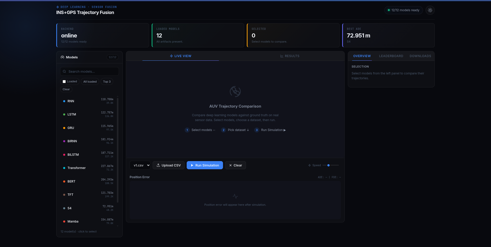

# INS/GPS Trajectory Fusion

[](https://ins-gps-fusion-dashboard.onrender.com)
[](https://ins-gps-fusion-api.onrender.com/health)

A full-stack deep learning system for sensor fusion, designed to predict autonomous vehicle (AUV/UAV) trajectories using IMU, GPS, and vehicle state data.


*(Note: To display the preview above, take a screenshot of your live dashboard, save it as `preview.png` inside an `assets` folder in this repo.)*

This repository features **12 distinct neural network architectures**—ranging from classic recurrent networks to state-of-the-art state-space models—all optimized for CPU inference and visualized through a modern, interactive dashboard.

## 🧠 Supported Models

The backend serves 12 pre-trained models. Because of their efficient design (small hidden sizes, fast-mode configurations), all model weights combined are under 6MB and run lightning-fast on standard CPUs.

- **Recurrent**: RNN, LSTM, GRU, BiRNN, BiLSTM
- **Attention/Transformer**: Transformer, BERT, TFT (Temporal Fusion Transformer)
- **State-Space (SSM)**: S4, Mamba, Mamba2, BiMamba

## 🚀 Tech Stack

- **Backend**: FastAPI, PyTorch (CPU-only optimized), Python 3.11
- **Frontend**: Vanilla HTML/JS/CSS (No build step required), modern dark/light mode UI
- **Inference**: Batched sequence modeling with periodic ground-truth resets to prevent dead-reckoning drift.

## 📁 Repository Structure

```
.
├── backend/
│   ├── main.py               # FastAPI inference server
│   ├── models.py             # PyTorch architecture definitions for all 12 models
│   ├── requirements.txt      # Python dependencies
│   ├── Dockerfile            # CPU-optimized Docker container
│   └── artifacts/            # Pre-trained model weights (.pkl files)
├── frontend/
│   ├── index.html            # Main dashboard UI
│   ├── app.js                # Frontend logic and API integration
│   └── config.js             # API endpoint configuration
├── data/                     # Data directory (CSV datasets are git-ignored due to size)
├── DEPLOYMENT.md             # Comprehensive deployment guide
└── render.yaml               # Render.com Blueprint configuration
```

## 🛠️ Quick Start (Local Development)

### 1. Start the Backend

```bash
cd backend
python3 -m venv venv
source venv/bin/activate  # On Windows use: venv\Scripts\activate

# Install dependencies
pip install -r requirements.txt
# Install CPU-optimized PyTorch (saves ~2GB of unnecessary CUDA libraries)
pip install torch --index-url https://download.pytorch.org/whl/cpu

# Run the API
uvicorn main:app --reload --port 8000
```
The interactive API documentation will be available at [http://localhost:8000/docs](http://localhost:8000/docs).

### 2. Start the Frontend

In a new terminal:
```bash
cd frontend
# Serve the static files locally
python3 -m http.server 5500
```
Open [http://localhost:5500](http://localhost:5500) in your browser. The dashboard is pre-configured to connect to `localhost:8000`.

## 🌐 Deployment

This project is containerized and ready for cloud deployment. It can be hosted entirely for free on platforms like Render, or scaled up on GCP Cloud Run / AWS.

For detailed, step-by-step instructions on deploying both the backend and frontend to various cloud providers, see the [DEPLOYMENT.md](DEPLOYMENT.md) guide.

## 📊 Dataset Note

Due to GitHub file size limits, the large raw `.csv` sensor datasets (e.g., `v1.csv`, `s1.csv`) are excluded from this repository. 
- You can upload your own sensor datasets directly through the frontend dashboard using the **Upload CSV** feature.
- The dashboard also features a **Synthetic Field Path** simulator that allows you to test model inference and visualization without needing real sensor data.
